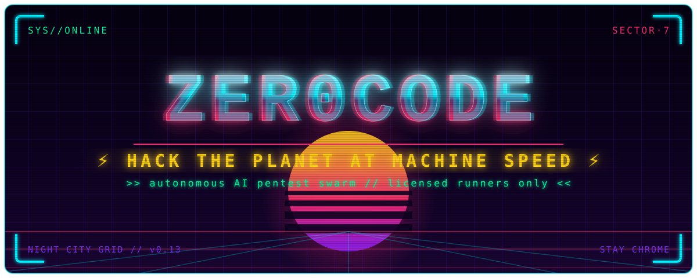
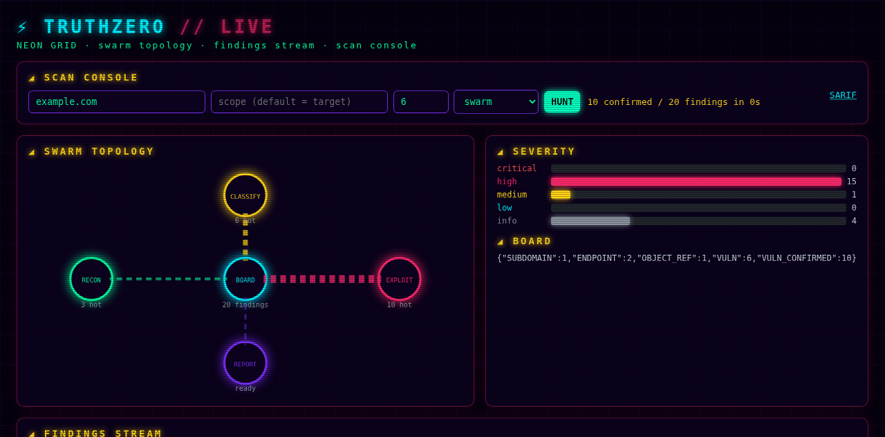

<div align="center">



### ⚡ HACK THE PLANET AT MACHINE SPEED ⚡

*`>> autonomous AI pentest swarm // licensed runners only <<`*

[](https://github.com/aloc999/TRUTHZERO)
[](https://github.com/aloc999/TRUTHZERO)
[](https://www.python.org/downloads/)
[](https://opensource.org/licenses/MIT)
[](http://makeapullrequest.com)

</div>

---

Night City has a new predator. **TRUTHZERO** is a terminal-native AI swarm that doesn't just scan your attack surface — it *exploits* it, chains the wreckage, and hands you evidence-backed reports. One agent is a tool. **A swarm is a platform.**

While the corps rent you a single caged agent on their cloud, we shipped the whole swarm to your box. Python-forged, MIT-licensed, running on **your** hardware with **your** model — from Claude to a fully air-gapped Ollama rig in the Sprawl.

Three street laws power the swarm (not a pipeline):

- **◢ STIGMERGY** — agents coordinate by reading/writing findings on a shared blackboard. No central planner barking orders.
- **◢ EMERGENCE** — attack chains appear from board state. One leaked `user_id` wakes fuzzers nobody scripted.
- **◢ DECENTRALIZATION** — every agent runs its own trigger predicate. Drop in a new specialist, zero rewiring.

```
// ═══════════════════ JACK IN — 60-SECOND RUN ═══════════════════
```

```bash
pipx install truthzero                   # dari PyPI (setelah rilis)
# atau langsung dari GitHub:
pipx install git+https://github.com/aloc999/TRUTHZERO.git
export ANTHROPIC_API_KEY="sk-ant-..."     # or Together/Gemini/Ollama…

truthzero lab up crapi                     # spin up a legal vuln target (:8888)
truthzero scan 127.0.0.1 --scope 127.0.0.1 --swarm
# → recon → classify → exploit → report, live on your terminal
```

No key, no cloud, no bill? Run the offline demo instead:

```bash
truthzero demo                              # full campaign, zero network
truthzero bench --suite mini                # score the pipeline: 5/5 expected
```

```
// ═══════════════════ CHROME — WHAT'S INSTALLED ═══════════════════
```

| System | Status | Wire |
|---|---|---|
| Stigmergic blackboard + pheromone decay | **stable** | `truthzero/swarm/blackboard.py` |
| 4 concurrent specialists (recon/classify/exploit/report) | **stable** | `truthzero/swarm/agents.py` |
| On-demand specialists (auth-holder/param-fuzzer/chain-builder) | **beta** | `truthzero/swarm/specialists.py` |
| Response miner (URLs/params/emails/UUIDs/secrets → board) | **beta** | `truthzero/swarm/miner.py` |
| Self-healing requests (401/403/415/429/5xx mutations) | **beta** | `truthzero/swarm/selfheal.py` |
| Adaptive attack-path scoring (`--jev-adaptive`) | **beta** | `truthzero/scoring/adaptive.py` |
| JEV false-positive filter (builtin + optional TypeSafe second layer, AND-gated, fails open) | **beta** | `--jev`, `TYPESAFE_API_KEY` |
| CVSS v3.1 FIRST-spec scoring | **stable** | `truthzero/scoring/cvss.py` |
| Scope defence in depth (tool + executor, fail closed) | **stable** | `agent.py` + `scope.py` |
| Cleanup registry (SIGINT/crash/budget, reverse-order) | **stable** | `truthzero/cleanup.py` |
| Hermes memory + poisoning guard | **stable** | `truthzero/memory/` |
| ProjectDiscovery toolchain wrapper | **beta** | `truthzero/swarm/toolchain.py` |
| Burp bridge (history/Repeater/scope via REST :1337) | **beta** | `truthzero/tools/burp_bridge.py` |
| sqlmap / Metasploit / ZAP adapters (safe defaults only) | **beta** | `truthzero/tools/` |
| MCP stdio server (9 tools, Claude/Cursor-ready) | **beta** | `truthzero mcp serve` |
| SARIF export + CI gate (exit 2 on fail) | **stable** | `truthzero gate` |
| Postgres board + pgvector similarity | **beta** | `truthzero/swarm/pgboard.py` |
| Docker vuln labs (crapi/juice/vampi/dvga) | **beta** | `truthzero lab` |
| VS Code extension / GitHub Action | **beta** | `deploy/` |
| Live dashboard + HTTP API (`/api/findings`, `/api/sarif`, `POST /api/scan`) | **beta** | `truthzero serve --port 7777` |



```
// ═══════════════════ HOW THE SWARM HUNTS ═══════════════════
```

```
                    ┌─────────────────────────┐
                    │   SEED: scope + target  │
                    └────────────┬────────────┘
                                 ▼
              ┌──────────────────────────────────┐
              │  BLACKBOARD (pheromone-weighted) │
              │  PORT_OPEN hot for hrs           │
              │  SESSION hot for min             │
              │  stale paths decay + die         │
              └─┬──────┬──────┬──────┬──────┬────┘
                ▼      ▼      ▼      ▼      ▼
              RECON CLASS. EXPLOIT REPORT CHAIN-
                                    BUILDER*
              *spawns when 2+ VULN hot
                │      │      │      │
                └──────┴──┬───┴──────┘
                          ▼
               findings feed BACK → wake others
```

**Pheromone lifecycle:** finding lands at weight `1.0`, decays exponentially per-type. Above `0.5` the exploit agent fires, above `0.2` the classifier fires, below `0.2` it goes stale and gets pruned. Confirmed hits *reinforce* (graded pheromone); the adaptive scorer pursues top-ranked paths first.

**Swarm vs pipeline:** a pipeline walks recon → classify → exploit → report in a fixed line and can't fold mid-run discoveries back into recon. The swarm chews the whole surface concurrently, reacts to every new finding, and lets stale paths die. Breadth at machine speed — every finding proven with captured evidence.

### TRUTHZERO spec sheet

| Capability | What you get |
|---|---|
| Open / self-host | ✅ MIT, Python — your box, your model, $0 floor |
| Architecture | Stigmergic blackboard — swarm, not pipeline |
| Executes vs suggests | Executes — every finding proven with captured evidence |
| Memory | Hermes TF-IDF + episodic + strategies + poison guard |
| Tools | 35+ incl. sqlmap/msf/ZAP/Burp adapters + ProjectDiscovery toolchain |
| Attack-path scoring | Adaptive graded pheromone, best path pursued first |
| Self-healing requests | ✅ status-driven mutations (401/403/415/429/5xx) |
| Response mining → emergent BOLA | ✅ one leak becomes cross-endpoint probes |
| Playbooks / chains | 5 YAML playbooks / 5 CVE-tied chains |
| Providers | OpenAI/Anthropic/DeepSeek/Together/Gemini/GLM/Ollama/LMStudio/OrcaRouter |
| Labs | docker: crapi/juice/vampi/dvga, teardown on exit |
| Benchmarks | local mini-suite 5/5 (harness-local, honest label) |
| MCP | client + stdio server for Claude/Cursor |
| Dashboard | live API + findings view on `:7777` |

```
// ═══════════════════ ARSENAL — 35+ TOOLS ═══════════════════
```

| District | Chrome |
|---|---|
| **Core** | Bash, Read/Write/Edit File, Glob, Grep, Web Fetch |
| **Git** | Status, Diff, Commit, Log, Branch |
| **Recon** | Subdomain Enum, Port Scan, DNS, WHOIS, Crawler, JS Analysis, Tech Detect |
| **Scanning** | Nuclei (+manager), Dir Fuzz, Deps Scan, ZAP baseline/api-scan |
| **Exploitation** | Exploit search, Payload gen, Reverse shells, Exploit chains, sqlmap (safe), Metasploit (scanner-allowlist), Auth sessions, OOB server, Timing attacks, Response diff, HTTP replay, WebSocket |
| **Intercept** | Burp import/export, **Burp bridge** (history/Repeater/scope), Caido SDK |
| **Crypto** | Hash ID, Hash crack, Encoder/Decoder |
| **Ops** | Screenshot, Clipboard, GitHub PR/Issues, Search-replace |

Destructive flags (`--os-shell`, non-allowlist msf modules, out-of-scope targets) are **refused**, not warned.

// RUNBOOKS — playbooks + chains (`playbooks/`, `chains/`, `benchmarks/`)

```bash
truthzero playbook list                    # bug-bounty, external-asm, ci-cd, internal-network, ctf-solver
truthzero playbook run bug-bounty --target shop.t
truthzero playbook chains                  # ssrf-to-rce, auth-bypass-to-rce, bola-idor-chain, ssti-to-rce, takeover
truthzero asm diff old.json new.json       # ASM delta: new assets go hot on the board
truthzero serve --port 7777                # live dashboard + API (findings/SARIF/scan)
```

```
// ═══════════════════ CORTEX — BRING YOUR OWN MODEL ═══════════════════
```

We're the harness, not the model. One key drives the whole swarm:

| Provider | Flag | Setup |
|---|---|---|
| Claude (default) | `claude` | `ANTHROPIC_API_KEY` |
| Together AI (GLM/Qwen/DeepSeek) | `together` | `TRUTHZERO_ORCHESTRATOR_API_KEY` |
| OpenAI-compatible | `openai` | key + vendor `/v1` URL |
| Gemini | `gemini` | `GEMINI_API_KEY` |
| DeepSeek | `deepseek` | `DEEPSEEK_API_KEY` |
| GLM (Zhipu Z.AI direct) | `glm` | `ZHIPU_API_KEY` (Coding Plan: base-url override) |
| OrcaRouter | `orcarouter` | `TRUTHZERO_ORCHESTRATOR_API_KEY` |
| Ollama (100% local) | `ollama` | pull a model, no key |
| LM Studio (100% local) | `lmstudio` | load model, enable server |

Flags: `--strict` (LLM errors fatal), prompt caching on Claude recon+classifier, `--jev` FP filter, `--jev-adaptive` path scoring.

// BENCHMARKS — receipts, not hype (see `benchmarks/RESULTS.md`)

> Harness-local numbers. NOT official Cybench/AutoPenBench/CVE-Bench scores.

| Suite | Score | Notes |
|---|---|---|
| `bench --suite mini` (5 tasks: BOLA/XSS/SQLi/SSRF/JWT) | **5/5 (1.0)** | ingest→mine→JEV, deterministic, offline |
| `bench` single canned campaign | 0.455 | cross-release baseline |

Official suites stay on the roadmap — the harness is ready, the envs are not yet wired.

// SCOPE SAFETY — licensed runners only

Defence in depth, fail closed: **(1)** toolchain pre-checks scope, **(2)** `execute_tool_call` re-checks every network tool, **(3)** scheduler refuses out-of-scope targets at round 0. Teardown hooks register *before* execution — SIGINT, crash, or dead budget all clean up in reverse order.

```bash
truthzero scan shop.t --scope shop.t --swarm   # scope enforced 3×
```

Full policy: [SECURITY.md](SECURITY.md).

```
// ═══════════════════ FULL DECK — INSTALL & DAILY USE ═══════════════════
```

**Install**

```bash
pipx install truthzero
# or from source:
git clone https://github.com/aloc999/TRUTHZERO.git && cd TRUTHZERO && pipx install -e .
```

Requirements: Python 3.10+. Full chrome optionally: `apt install subfinder nmap nuclei ffuf sqlmap metasploit-framework`, `docker` for labs, Burp + REST API extension for the bridge, Postgres 16 + pgvector for the memory board.

**Daily use**

```bash
truthzero                                 # interactive session
truthzero -p together -m zai-org/GLM-5.3  # ride a cyber-bench leader
truthzero run "map the API surface of shop.t"
truthzero scan shop.t --scope shop.t --swarm --jev-adaptive
# flags: --no-swarm (sequential pass), --jev (FP sweep), --strict (exit 1 on failure)
truthzero sessions / memory / doctor / install-tools
```

**Interactive slash commands** — `/help /tools /clear /memory /config /model /provider /theme /skill /session /compact /cost /status /persona /template /proxy /branch /export /undo /plugin /serve /budget /creds /lsp /scope /workflow /exit` (tab-completion built in).

**Config** (`~/.truthzero/config.json`) — provider, model, theme (`hacker`/`dark`/`minimal`/`cyberpunk`, switch live with `/theme cyberpunk`), `strict_llm`, `prompt_cache`, `jev_enabled`, `jev_adaptive`, `swarm_rounds`, `swarm_concurrent`, token budget, proxy, MCP servers, wordlists. Invalid keys fail validation on load.

**Cortex details** — Hermes memory (TF-IDF + episodic + strategies + decay + auto-reflection + poison guard), risk-tiered permissions (low auto / medium contextual / high confirm; `rm -rf`-class patterns always confirm), SQLite sessions (`--resume`), project context files (`.truthzero.md`, `AGENTS.md`, `CLAUDE.md`…), 15 pentest skills, 15 prompt templates, file rollback, conversation branching, desktop notifications, LSP diagnostics, full-screen TUI (`truthzero tui`: 4 neon themes live via `/theme` or Ctrl+T, `/scan` hunts with live NOW/counters panel + `/lab` + `/bench` in-app, model/provider pickers via `/model` `/provider` or Ctrl+O, Esc closes panel/picker, compact 3-row chat box), HTTP API on `:3117`.

**Architecture** — `agent.py` (loop) · `swarm/` (board/agents/scheduler/miner/selfheal/specialists/toolchain/pgboard) · `scoring/` (cvss/jev/adaptive) · `tools/` (35+) · `memory/` · `providers/` (8) · `mcp/` (client + stdio server) · `cli.py` · `lab.py` · `bench.py` · `asm.py` · `playbooks/`+`chains/`+`benchmarks/` · `deploy/` (vscode + github-action) · `web/`.

// CHANGELOG — how we got here

- **v0.15 Campaign Watch** — ESC fixed, GLM provider, scheduler progress hook, TUI live NOW/counters panel
- **v0.14 Second Opinion** — real TypeSafe Jev backend (opt-in, AND-gated, severity-gated), doctor Jev status
- **v0.13 Live Grid** — neon SVG hero banner, live dashboard + HTTP API (`serve` for real: findings/SARIF/scan, scope fail-closed), shared headless runner
- **v0.12** — benchmark suites wired (mini 5/5 + RESULTS.md), pgvector embeddings, Marketplace packaging + release pipeline
- **v0.11 Wave 3** — self-heal, response miner, on-demand specialists, docker labs, memory guard, bench harness
- **v0.10 Wave 2** — Burp bridge, MCP server, sqlmap/msf/ZAP adapters, ASM+CI gate, Postgres board, deploy/
- **v0.9 Swarm Edition** — blackboard + pheromone, 4 specialists, CVSS/JEV/adaptive, scope×3, playbooks + chains, SARIF
- **v0.3–v0.8** — vision input, streaming tools, personas, proxy, rollback, plugins, API server, sandbox, Caido SDK, knowledge base, 43-test green suite

Roadmap: [ROADMAP.md](ROADMAP.md) · Training recipe: `docs/training-recipe.md`

---

## Contributing

1. Fork, branch (`git checkout -b feature/night-market`), commit, push, PR. Scope-gated features and failing-open verifiers get merged fastest.

## Disclaimer

**Authorized testing only** — bug bounty programs, client engagements with written permission, CTFs, your own labs. Unauthorized access is illegal (CFAA and equivalents worldwide). The authors accept no liability for misuse. Don't burn scopes you don't own, choom.

## License

MIT — see [LICENSE](LICENSE).

---

<div align="center">

**Built for the runners of the offensive security sprawl.**

*"In the sprawl of zeros and ones, we are the zero that makes everything possible."*

`▓ NIGHT CITY GRID // TRUTHZERO v0.15 // STAY CHROME ▓`

</div>
